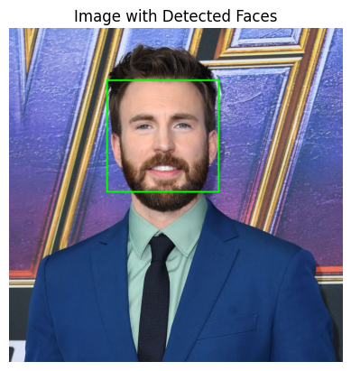

# Face and Eye Detection

## Overview
This project focuses on detecting faces and eyes in images using OpenCV and Haar cascades. It includes functions to detect faces, eyes, and both in an image.

## Prerequisites
- Python 
- OpenCV
- Matplotlib

## Example

1. **Original**

   
   

2. **Face Detection**

   
   

3. **Eyes Detection**

   
   

4. **Face and Eyes Detection**

   
   

## Maintainer
This project is maintained by Sparsh Marwah, a Data Scientist with over 3 years of professional experience in Python, machine learning, and data visualization.

### Contact Information
- Email: marwahsparsh24@gmail.com
- GitHub: https://github.com/marwahsparsh24
- LinkedIn: https://www.linkedin.com/in/sparsh-marwah/